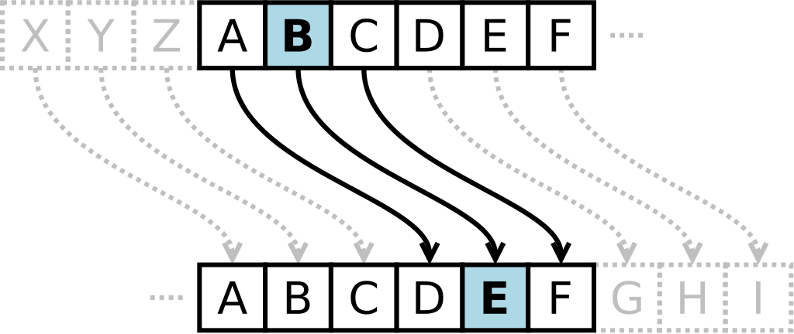
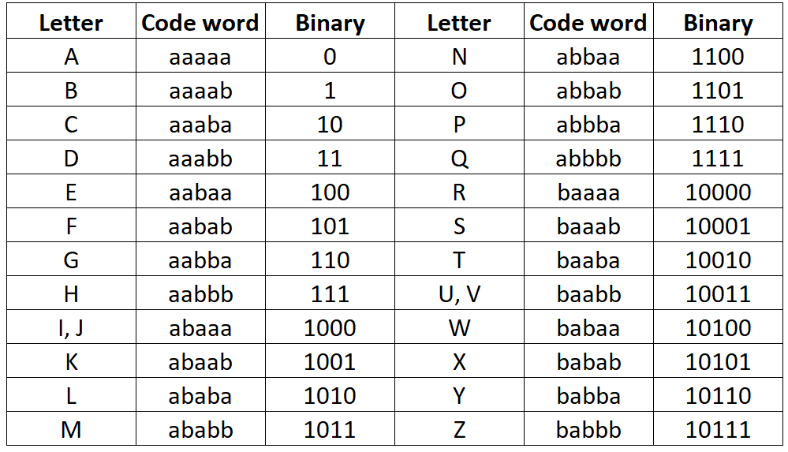

# 古典密码

古典密码是指在现代计算机技术出现之前使用的加密方法，主要**基于字符**，分为两种类型：`代换密码`和`置换密码`。

## 代换（替换）密码（Substitution Cipher）

代换密码是将明文中的字符替换成其他字符，即替代转换。若加密过程中，每个字符采用同一张表替代，则为**单表代换密码**；若整个加密过程中每个字符采用不同的表替代，则为**多表代换密码**。

破解代换加密的基本方法是用统计手段，即统计语言中的一些字或字母出现频率的规律。

### 单表代换密码

单表代换密码是在明文和密文之间建立一一映射关系，也就是说明文与密文一一对应。所以有以下两种方式来进行破解：

1. 在密钥空间较小的情况下，采用暴力破解方式
2. 在密文长度足够长的情况下，采用词频分析方式

当密钥空间足够大，且密文长度足够短的情况下，破解较为困难。

#### 单字母替换密码（Mono-Alphabetic Substitution Cipher）

每个字母被固定的替换为另一个字母。

```python
key = {
    "a": "f",
    "b": "y",
    "c": "a",
    "d": "b",
    "e": "z",
    "f": "c",
    "g": "m",
    "h": "s",
    "i": "n",
    "j": "t",
    "k": "o",
    "l": "h",
    "m": "q",
    "n": "v",
    "o": "r",
    "p": "x",
    "q": "w",
    "r": "i",
    "s": "k",
    "t": "u",
    "u": "l",
    "v": "j",
    "w": "p",
    "x": "g",
    "y": "d",
    "z": "e"
}

secret = "The trouble with having an open mind, of course, is that people will insist on coming along and trying to put things in it.".lower()
secret = filter(str.isalpha, secret)

encrypted = "".join([key[i] for i in secret])
print(encrypted)
#uszuirlyhzpnussfjnvmfvrxzvqnvbrcarlikznkusfuxzrxhzpnhhnvknkurvarqnvmfhrvmfvbuidnvmurxluusnvmknvnu
```

由于密文中的字母频率没有变化，在较长的密文和英文文本的情况下，可以通过字母频率分析来破解密码。可以使用在线工具 <https://quipqiup.com/> 辅助解密。


- <https://cryptii.com/pipes/alphabetical-substitution>
- <https://www.101computing.net/mono-alphabetic-substitution-cipher/>

#### 移位密码（凯撒密码）

凯撒密码（Caesar Cipher）是移位密码（Shift Cipher）的一种，通过将明文中每个字母在字母表中向前或向后移动固定的长度来生成密文。例如，当偏移量为 3 时，字母`A`会被替换为`D`，字母`B`会变成`E`，以此类推。



> 凯撒密码的密钥是 0 到 25 之间的整数，因此可以通过穷举法进行破解。

#### ROT系列密码

- [ROT13](https://rot13.com/)，实际上是凯撒密码的一种，默认位移量为 13，仅适用于字母，连续两次加密可恢复明文。
- [ROT47](https://rot47.net/)，处理 ASCII 码在 33 到 126 之间的字符，默认旋转位移为 47 。
- [ROT8000](https://rot8000.com/)，通过将每个 Unicode 字符向前或向后移动`0x8000`个位置。

#### 埃特巴什码（Atbash Cipher）

埃特巴什码（Atbash Cipher）是一种单字母替换密码，采用字母表中的最后一个字母代表示第一个字母，倒数第二个字母表示第二个字母，以此类推。

```
明文：ABCDEFGHIJKLMNOPQRSTUVWXYZ
密文：ZYXWVUTSRQPONMLKJIHGFEDCBA
```

例如，明文`MIRROR`加密为`NRIILI`。埃特巴什码也被称为`镜像密码`。

<!-- #### rabbit -->

#### 仿射密码（Affine Cipher）

仿射加密（Affine cipher）是一种基于线性变换的加密方法。

加密过程：
$$
E(x)=(ax+b) \mod m
$$

解密解密：
$$
D(x)=a^{-1}(x-b) \mod m
$$

`x`为字符在字母表中的位置，从`0`开始。`m`为字母表的长度，例如对于英文字母为 26。

假设我们要加密字符串 "HELLO"，使用以下参数：

- a=5
- b=8
- 字母表长度 m=26

`H → 7`

`E(7)=(5⋅7+8) mod 26 = (35+8) mod 26 = 17`,17 对应的字母为 R。
因此，字符串 "HELLO" 的加密结果是 "RCLLA"。

#### 培根密码（Bacon Cipher）

培根密码（Bacon Cipher），又叫倍康尼密码，是由法兰西斯·培根发明的一种替换密码。加密时，明文中的每个字母都会替换成一组五个英文字母。其转换依靠下表：



转换表有两个版本。一是`i` 和`j`、`u`和`v`使用相同的编码。二是所有字母使用不同的编码。
例如，对明文`hello world`进行加密。步骤如下：
第一步，将`H`替换为`aabbb`，`E`替换为`aabaa`等等


第二步，隐藏信息。常规字体表示`a`，粗体表示`b`


也可以使用大小写来隐藏信息。

```
sSsSSsSSssSSsSsSsSssSSSSSSSssS{SSSsSsSSSsSsSSSsSSsSSssssssSSSSSSSsSSSSSSSSsSSsssSSssSsSSSsSSsSSSSssssSSsssSSsSSsSSSs}
```

```
UTFLAG{CRISPYBACONCIPHER}
```

培根密码本质上是将二进制信息通过样式的区别，加在了正常书写之上，样式包括大小写、斜体和加粗等。培根密码所包含的信息可以和用于承载其的文章完全无关。

<!-- #### 希尔密码（Hill Cipher）希尔密码（Hill Cipher） -->

### 多表代换密码

在多表代换中，由于使用不同的字母表或关键词，相同的明文字母在不同的位置可能会对应不同的密文字母，实现`动态替换`。同时，明文字符的频率被改变，从而抵抗词频分析攻击。

<!-- #### 棋盘密码 -->

#### 维吉尼亚密码（Vigenère Cipher）

维吉尼亚密码是一种基于凯撒密码的加密算法，属于多表代换的简单形式。

加密时，密钥长度必须与明文长度相等，如果关键词长度不足，需要将其扩展至明文长度。该算法有重复（`Repeat`）和自钥（`Autokey`）两种模式，默认使用`重复模式`，即固定关键词重复扩展，如关键词为`key`时重复扩展为`keykey....`。自钥模式则是将关键词与明文组合形成密钥，如`key明文`。


例如，明文`HELLOWORLD`，关键词`SECRET`，对于明文第 1 个字母 `H`，对应密钥的第 1 个字母 `S`，于是使用第 S 行字母进行加密，得到密文第一个字母 `Z`，以此类推，密文为`ZINCSPGVNU`。

- <https://cryptii.com/pipes/vigenere-cipher>

#### 普莱费尔密码（Playfair Cipher）

普莱费尔密码（Playfair Cipher）是第一个二字母替换密码，1854 年由英国人查尔斯 · 惠斯通（Charles Wheatstone）发明，基本算法如下：

例如，选取密钥为`playfair`，去除重复字母后，得到`playfir`，将字母按顺序填入$5 \times 5$的矩阵中，余下的位置用字母表中剩下的字母填充，其中`i`和`j`作为同一个字母。

> 注意，由于矩阵大小只有25个，而字母有26个，可以将`i`和`j`视作同一字母，或者将`q`去除。

$$
\begin{array}{ccccc}
P & L & A & Y & F \\
I & R & B & C & D \\
E & G & H & K & M \\
N & O & Q & S & T \\
U & V & W & X & Z \\
\end{array}
$$

加密过程如下：

- 将明文去掉空格后，每两个字母一组，如果一组中的字母相同，则在中间插入一个填充字母（通常为`X`），然后重新分组。必要的话，在最后一组末尾加字母`X`。例如明文为`HELLO`，分组结果为`HE LX LO`。
- 对每一组字母，按照以下规则进行加密
  - 如果两个字母在同一行，则用它们右边的字母替换（如果在最右边，则循环到最左边）。例如`HE`->`KG`。
  - 如果两个字母在同一列，则用它们下边的字母替换（如果在最下边，则循环到最上边）。例如`LO`->`RV`。
  - 如果两个字母不在同一行也不在同一列，则用它们所在矩阵的对角线上字母替换。例如`LX`->`YV`。

完整的密文是`KGYVRV`。解密时，将这一过程倒过来。

<!-- 例题： [picoCTF 2021 Play nice](https://ctftime.org/task/15292)
https://github.com/Dvd848/CTFs/blob/master/2021_picoCTF/Play_Nice.md -->

### 图形代换密码

#### [猪圈密码](https://www.dcode.fr/pigpen-cipher)（Pigpen Cipher）

猪圈密码是一种以格子为基础的图形代换密码，最初由希伯来拉比和圣殿骑士使用。它通过将字母放置在“#”和“X”图形中，通过附近的线条和点表示编码字母，主要有两个版本：原始版本和修改版本。


例如，明文`X marks the spot`的密文如下：


在线加解密网站：

- <https://rumkin.com/tools/cipher/pigpen/>
- <https://www.dcode.fr/pigpen-cipher>

<!-- #### 键盘密码 -->

#### 跳舞小人密码（Dancing Men Cipher）


#### 键盘密码

所谓键盘密码，就是采用手机键盘或者电脑键盘进行加密。

- 手机键盘密码

手机键盘加密方式，是每个数字键上有 3-4 个字母，用两位数字来表示字母，例如：ru 用手机键盘表示就是：7382，那么这里就可以知道了，手机键盘加密方式不可能用 1 开头，第二位数字不可能超过 4，解密的时候参考此。


关于手机键盘加密还有另一种方式，就是「音的」式（这一点可能根据手机的不同会有所不同），具体参照手机键盘来打，例如：「数字」表示出来就是：748 94。在手机键盘上面按下这几个数，就会出：「数字」的拼音。

- 电脑键盘棋盘

电脑键盘棋盘加密，利用了电脑的棋盘方阵。


- 电脑键盘坐标

电脑键盘坐标加密，利用键盘上面的字母行和数字行来加密，例：bye 用电脑键盘 XY 表示就是：351613


- 电脑键盘 QWE
电脑键盘 QWE 加密法，就是用字母表替换键盘上面的排列顺序。


例题分析：[SWPUCTF 2021 新生赛]我的银行卡密码

<!-- https://blog.csdn.net/2301_76328911/article/details/136545008 -->

## 置换密码

置换密码（Transposition Cipher）又称为转置密码或换位密码，是指通过改变明文中各字符位置得到密文，其字符不变，但位置改变，即**位置转换**。典型的有栅栏密码、曲路密码等。

### 栅栏密码

栅栏密码（Rail Fence Cipher）通过将文本以波浪形排列实现。根据排列形状，分为 W 型（传统型）和 N 型。以下是对明文`helloworld`按照 3 栏加密的传统型示例。

- 默认偏移`offset`为 0，密文为`holelwrdlo`。

```
h...o...l.
.e.l.w.r.d
..l...o...
```

- 若偏移`offset`为 1，密文为`lrhloolewd`

```
...l...r..
h.l.o.o.l.
.e...w...d
```

例题分析：

`Ta _7N6DDDhlg:W3D_H3C31N__0D3ef sHR053F38N43D0F i33___NA`
，原文中存在
在线加解密网站：

- <https://www.geocachingtoolbox.com/index.php?page=railFenceCipher>
- <https://rumkin.com/tools/cipher/rail-fence/>

<!-- ### 曲路密码 -->

## 总结

- 如果给定的密文长度较长，考虑字母频率分析

## 参考资料
