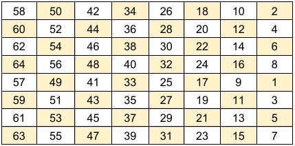

# 对称密码

## 流密码

## 分组密码（块密码）

### 分组密码工作模式


#### 电子密码本模式（ECB）

- 优点
  - 可以并行加密比特块
  - 块密码的简单实现方式

- 缺点
  - 易受密码分析的攻击，因为明文与密文之间存在直接关系
  - 相同的明文块生成相同的密文块，这可能暴露出模式

#### 密文反馈（CFB）

#### 密码块链接（CBC）

加密算法的输入是明文分组和前一个密文分组的异或，同样均使用相同的密钥进行加密。其中第一个明文加密时，需先与初始向量
 异或，再进入加密算法进行加密。

#### OFB

#### PCBC

### DES

数据加密标准（Data Encryption Standard，简称 DES）是一种对称密钥加密算法，广泛用于电子数据保护。它是由 IBM 开发的，并在 1977 年被美国国家标准协会（ANSI）采用为联邦信息处理标准（FIPS PUB 46），后来成为一种广泛使用的加密标准。

加密流程图如下：


**块密码**：DES 将固定长度的明文（64 位）分为多个 64 位的块进行处理。

**密钥长度**：使用 56 位的密钥进行加密，虽然实际的密钥长度为 64 位，但每第 8 位用于奇偶校验。

**轮数**：DES 采用 16 轮的加密操作，每一轮包含选择、置换和混合步骤。

假设，明文为 M = `Hello World!`

转换为二进制

```
01001000 01100101 01101100 01101100 01101111 00100000 01010111 01101111 01110010 01101100 01100100 00100001
```

decimal_number = int(binary_string, 2)

按照 64 位分组

b1:

```
01001000
01100101
01101100
01101100
01101111
00100000
01010111
01101111
```

b2:

```
01110010
01101100
01100100
00100001
padding
padding
padding
padding
```

KEY:

```
00110100
00110101
10110101
10101000
00011101
11011011
10010000
00000100
```

- **初始置换**



即将输入的第 58 位换到第 1 位，第 50 位换到第 2 位，依此类推，最后一位是原来的第 7 位。

- **终止置换**

- **扩展置换**

S 盒压缩处理

使用了 8 个不同的 S-盒


每个 S 盒接受 6 位输入，并返回 4 位输出


#### 弱密钥

弱密钥的出现源于密钥调度算法中的循环左移操作。

- 在生成子密钥时，56 位密钥被分成两个 28 位的半部分。
- 如果初始的 C₀ 和 D₀ 全部由 0 或全部由 1 组成，那么无论进行多少次循环左移，C₀ 和 D₀ 的值都不会改变！
- 这意味着：所有 16 轮的子密钥（K1 ~ K16）都将完全相同。

有 4 个明确的弱密钥

```
弱密钥（十六进制表示，含校验位） C₀ 状态 (28位) D₀ 状态 (28位) 原因
0x0101010101010101 全 0 全 0 全0的半部分
0xFEFEFEFEFEFEFEFE 全 1 全 1 全1的半部分
0x1F1F1F1F0E0E0E0E 全 0 全 1 一个全0，一个全1
0xE0E0E0E0F1F1F1F1 全 1 全 0 一个全1，一个全0
```

这意味着：加密函数和解密函数是同一个函数。`E(K, E(K, P)) = P`

示例：

<https://github.com/VoidHack/write-ups/tree/master/SharifCTF%208/crypto/DES>

### 3DES


## 参考资料

- <https://zh.wikipedia.org/wiki/DES%E8%A1%A5%E5%85%85%E6%9D%90%E6%96%99>
- <https://sandilands.info/crypto/DataEncryptionStandard.html#>
- <https://www.youtube.com/watch?v=3YBwhWuXZ0o>
- <https://www.cnblogs.com/idreamo/p/9333753.html>
- <https://fluix.one/blog/picoctf-2021-ddes/>

```
53616c7465645f5f0c160de825c4925b6543fa6c52dc91b4487b8252966d9de6aec8508b95522f879232bf89e3066440
```
