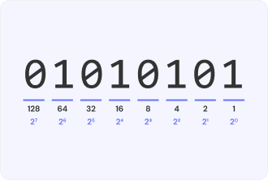

# 编码

## 进制

### 二进制（Binary）



二进制是一种使用 `0` 和 `1` 的数值表示方式。每个二进制位称为`比特`（bit）。

### 八进制（Octal）

### 十进制（Decimal）

### 十六进制（Hexadecimal）

十六进制是一种基数为 16 的数值表示法，数字是由 0 到 9 和 A 到 F 组成，广泛应用于计算机科学及其相关领域。


由于 1 Byte = 8 Bit，一个字节的一半（4 位）有 16 种不同的组合，也就是说可以用两个十六进制数来表示一个字节。

常见用来表示十六进制数的前缀有`0x`和`\x`，如`0xA`、`\x61`等。

`666c61677b733333696e675f6833787d`

[CyberChef](https://gchq.github.io/CyberChef/#recipe=From_Hex('None')&input=NjY2YzYxNjc3YjczMzMzMzY5NmU2NzVmNjgzMzc4N2Q&ieol=CRLF&oeol=CRLF)

```bash
$ python3
Python 3.13.3 (main, Apr 10 2025, 21:38:51) [GCC 14.2.0] on linux
Type "help", "copyright", "credits" or "license" for more information.
>>> bytes.fromhex("666c61677b733333696e675f6833787d").decode()
'flag{s33ing_h3x}'
```

## ASCII

ASCII（**A**merican **S**tandard **C**ode for **I**nformation **I**nterchange，美国标准信息交换码）是一种字符编码方案。

在计算机中，所有数据存储和运算都使用二进制表示，因计算机通过高电平和低电平分别对应 1 和 0。字母、数字以及常用符号在计算机中也需要使用二进制表示。为确保互通，必须使用统一的编码规则，因此美国标准化组织制定了 ASCII 编码，规定了常用符号对应的二进制数字。

标准 ASCII 使用 7 个比特来表示字符，因此可以编码 128 个不同的字符。扩展 ASCII 是在标准 ASCII 的基础上，使用 8 个比特来表示字符。


## Unicode

Unicode 是一种计算机字符编码标准，于 1987 年首次提出，旨在为所有语言和字符提供一个统一的编码系统。它的主要目的是解决不同字符集之间的不兼容问题，确保能够在全球范围内一致地处理和显示文本。Unicode 支持几乎所有现代书写系统，包括拉丁文、汉字、阿拉伯文、希腊文、德文和许多其他语言的符号和字符。

Unicode 支持多种编码形式，以满足不同应用程序的需求，包括：

- UTF-8：可变长度编码，兼容 ASCII，广泛用于互联网和现代应用。一个字符可以使用 1 到 4 个字节表示。对于 ASCII 字符（0-127），编码与标准 ASCII 相同；而对于其他字符，UTF-8 使用多个字节。
- UTF-16：通常用于需要处理大量东亚字符的环境，比如 Java 和 Windows。它使用 2 或 4 个字节表示每个字符。
- UTF-32：固定长度编码，使用 4 个字节表示每个字符，常用于内部处理和某些特定情况下。

## URL编码

## HTML实体编码

## 异或`XOR`

异或（XOR）是一种**位运算符**，符号为 `^`。其规则是：**两个二进制位相同则结果为 0，不同则结果为 1**。

| A | B | A ^ B |
|---|---|-------|
| 0 | 0 |   0   |
| 0 | 1 |   1   |
| 1 | 0 |   1   |
| 1 | 1 |   0   |

异或的性质：

1. 任意数与 0 异或结果为其本身：`A ^ 0 = A`
2. 任意数与自身异或结果为 0：`A ^ A = 0`
3. 异或运算满足交换律和结合律：`A ^ B = B ^ A`，`(A ^ B) ^ C = A ^ (B ^ C)`

### 示例代码

## 例题分析

### 例题-`XOR`

```
79737e786477706f7a4066706a406a6c7a7b407e406c7c6d766f6b62
```

- 题目分析

题目提供了一串十六进制数字，我们知道两个十六进制数字可以表示一个字节。根据题目名称，可以通过暴力破解方式来寻找异或秘钥，以实现解密。

- 解法一

```python
cipher = bytes.fromhex("79737e786477706f7a4066706a406a6c7a7b407e406c7c6d766f6b62")

# 遍历所有可能的单字节密钥（从 0x00 到 0xff）
for i in range(0x00, 0xff):
    result = "".join(chr(i ^ j) for j in cipher)
    if "flag" in result:
        print("Flag found:", result)
```

- 解法二

我们主要使用 [CyberChef](https://gchq.github.io/CyberChef/#recipe=From_Hex('None')XOR_Brute_Force(1,100,0,'Standard',false,true,false,'flag')&input=Nzk3MzdlNzg2NDc3NzA2ZjdhNDA2NjcwNmE0MDZhNmM3YTdiNDA3ZTQwNmM3YzZkNzY2ZjZiNjI) 的`XOR Brute Force`模块，在正确使用该模块之前，需要首先使用`From Hex`功能将提供的字符串转为以两个十六进制数表示的字节数组。


## 字母频率统计

```bash
$ cat flag.txt | fold -w1 | sort | uniq -c | sort -nr
2508 G
2481 X
2453 Y
2301 {
2221 g
2087 a
```

- `fold -w1` 将每个字符放在单独的一行。
- `sort` 对字符进行排序。
- `uniq -c` 统计出现次数。
- `sort -nr` 根据出现次数从高到低排序。
