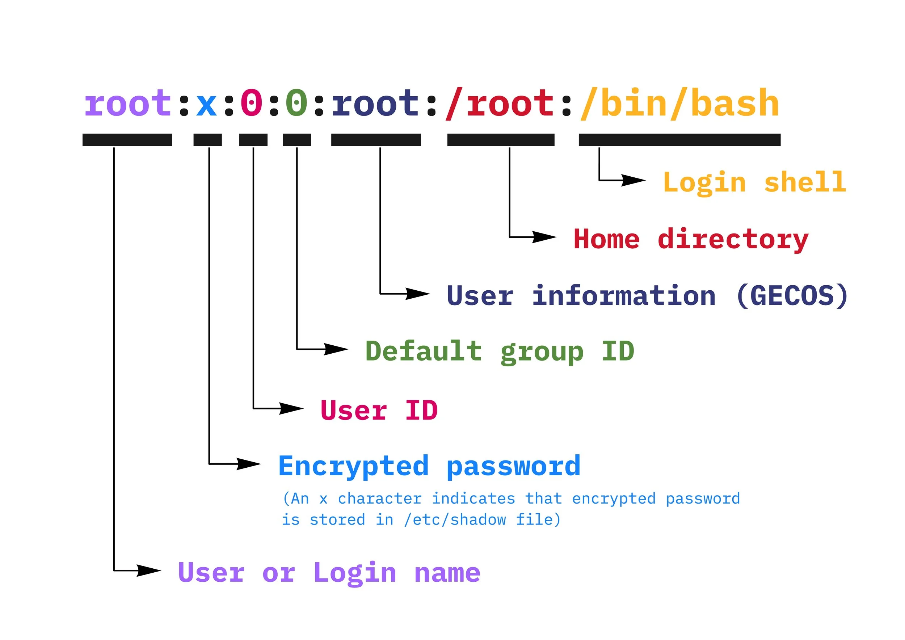
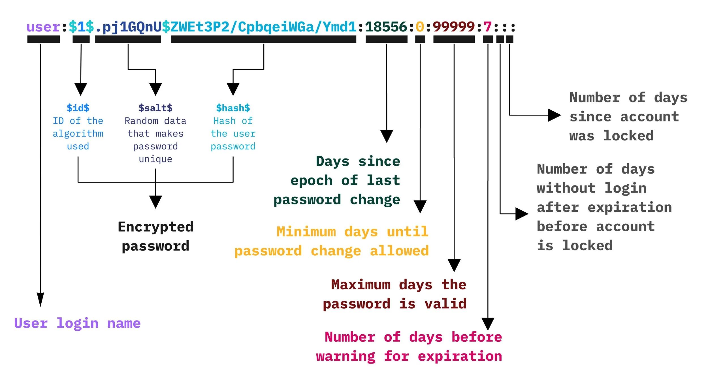
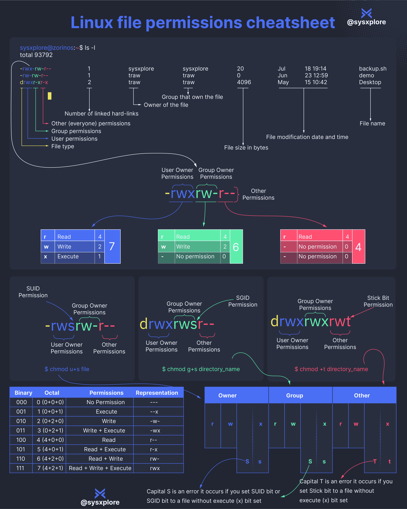

# Linux

## 用户和用户组

### 用户标识符 UID

**UID**（User Identifier，用户标识符）是 Linux/Unix 系统中用于唯一标识用户的**数字值**，存储于 `/etc/passwd` 和用户数据库（如 LDAP）中。系统内核实际通过 UID（而非用户名）进行权限校验和进程管理。

| UID 范围 | 类型 | 安全特性 |
|---|---|---|
| **0-99** | 系统用户 | 其中 UID 为 `0` 代表 `root` 用户，拥有系统最高权限，可绕过所有权限检查。渗透测试中常作为提权目标。|
| **100-999**  | 服务用户  | 用于运行守护进程（如 `mysql`, `www-data`），遵循最小权限原则，通常禁止交互登录。|
| **1000-60000** | 普通用户 | 默认交互登录用户范围（各发行版可能不同） |
| **65534** | `nobody` 用户 | 权限最低，常用于匿名访问（如 NFS、容器） |

<https://www.baeldung.com/linux/user-ids-reserved-values>

系统用户是为了系统管理和服务运行而创建的用户，其 UID 通常在 0 到 99 的范围内，这种 UID 是静态分配的。这意味着在操作系统初始化时，系统会自动创建这些用户并分配固定的 UID。

- **UID 0**: **超级用户 `root`**，拥有系统的全部权限，对系统资源和所有用户的完全控制权。
- **UID 1**: **`daemon`**，通常用于运行系统级别的后台服务和守护进程，负责处理系统任务而不需要用户交互。
- **UID 2**: **`bin`**，主要用于存放存取基本系统命令的用户，通常用于管理系统的可执行文件。

应用用户是由特定应用程序在其安装过程中创建的系统用户。这些用户用于运行应用程序并持有程序使用的相关资源。虽然应用用户的用户 ID 属于 100 到 999 的范围，这些值并不是静态的，而是动态分配的。这意味着同一个应用程序可能在不同的安装或运行环境中为其用户分配不同的用户 ID。例如，某个应用可能会在第一次安装时分配 UID 100，而在后续的安装中，可能会由于用户 ID 的使用情况而选择不同的值。

普通用户是系统中常规使用的用户，其权限和功能比系统用户要低，用户 ID 通常从 1000 开始。在 Linux 系统中，`/etc/login.defs` 文件定义了普通用户 ID 的范围，以及用户 ID 分配的其他规则。命令如 `useradd` 等会读取该文件，以便在创建新用户时分配合适的用户 ID。

影响普通用户 ID 上限的一个主要因素是 Linux 内核的版本。在 Linux 内核 2.4 及之前的版本中，用户 ID 的最大值为 65535，这对应于 16 位整数的最大值。而在 Linux 内核 2.6 及之后的版本上限已经扩展到 4,294,967,295，这对应于 32 位整数，从而为系统提供了更大的用户 ID 空间，满足日益增长的用户需求。

### GID

### 用户信息存储

`/etc/passwd` 是 Linux 系统的核心用户数据库文件，存储所有用户的基本信息。该文件全局可读（权限 `644`），但仅 `root` 用户可写。

```bash
$ ls -la /etc/passwd
-rw-r--r-- 1 root root 1829 Jul 30 08:01 /etc/passwd 
```

每行记录代表一个用户，包含 **7个字段**（冒号分隔）：

```bash
$ cat /etc/passwd
root:x:0:0:root:/root:/bin/bash
daemon:x:1:1:daemon:/usr/sbin:/usr/sbin/nologin
bin:x:2:2:bin:/bin:/usr/sbin/nologin
...
nobody:x:65534:65534:nobody:/nonexistent:/usr/sbin/nologin
...
mysql:x:116:119:MariaDB Server:/nonexistent:/bin/false
...
user1:x:1000:1000:User One,,,:/home/user1:/bin/bash
...
```

`用户名:密码占位符:用户ID:组ID:用户描述信息:家目录:登录Shell`

- 用户名：不能为空
- 密码占位符：
  - `x`：表示密码存储在`/etc/shadow`文件中
  - `空白`：表示用户未设置密码
  - `*`：表示禁止通过密码登录，通常用于系统服务账户（如 `nobody`、`www-data`）
- 家目录：用户登录后的默认工作目录
- 登录 Shell：用户登录后默认使用的 Shell

<https://www.cyberciti.biz/faq/understanding-etcpasswd-file-format/>



如果有权限修改 `/etc/passwd` 文件，则可以新建用户。

```bash
$ openssl passwd 123456
$1$pZLeoQJV$2Cmive6ZNPitgNUVqYVym0
```

hack:$1$pZLeoQJV$2Cmive6ZNPitgNUVqYVym0:0:0::/root:/bin/bash

```bash
$ ls -la /etc/shadow
-rw-r----- 1 root shadow 1088 Jul 30 08:01 /etc/shadow
```

<https://www.cyberciti.biz/faq/understanding-etcshadow-file/>



- 用户名，对应 `/etc/passwd` 中已存在的用户名。
- 密码：哈希密码（当 `/etc/passwd` 中密码字段为 `x` 时生效）。
- 最后修改日期：上次更改密码的天数（从 1970 年 1 月 1 日起计算），`0` 表示下次登录必须修改密码，空白表示无限制。
- 最短有效期：两次密码修改之间的最短天数，`0` 或空白表示可随时修改密码。
- 最长有效期：密码的有效期（天数），默认 `99999`。
- 警告期：密码到期前多少天开始提醒用户，默认 `7`。
- 宽限期：密码到期后多少天内账户仍可登录，超时则禁用。
- 失效日期：账户被禁用的日期（从 1970 年 1 月 1 日起计算），默认为空，用户不会被禁用。

| **前缀**  | **算法**          | **说明**                                                                 |  
|-----------|-------------------|--------------------------------------------------------------------------|  
| `$1$`     | MD5               | 已过时，易受碰撞攻击（如 `$1$salt$hash`）。                              |  
| `$2a$`    | Blowfish (bcrypt) | 早期实现，存在部分安全问题（如 `$2a$05$salt$hash`）。                   |  
| `$2b$`    | Blowfish (bcrypt) | 修复了 `$2a$` 的漏洞（现代系统推荐）。                                   |  
| `$2y$`    | Blowfish (bcrypt) | 与 `$2b$` 类似，部分系统兼容性别名。                                    |  
| `$5$`     | SHA-256           | 默认算法之一（如 `$5$rounds=5000$salt$hash`）。                         |  
| `$6$`     | SHA-512           | 更安全的算法（推荐），支持自定义迭代次数（如 `$6$rounds=656000$salt$hash`）。 |  
| `$y$`     | yescrypt          | 新一代抗 GPU/ASIC 算法（如 Ubuntu 22.04+）。                            |  
| `$argon2i$` | Argon2i          | 内存密集型算法，抗硬件破解（如 `$argon2i$v=19$m=65536,t=3,p=1$salt$hash`）。 |  
| `$argon2id$`| Argon2id         | Argon2 的混合模式，平衡安全性与性能。                                   |  
| `$7$`     | Scrypt           | 需要大量内存的算法（较少见，如 `$7$CUSTOM$salt$hash`）。                 |  

### 参考资料

- <https://systemd.io/UIDS-GIDS/>

## 文件权限



**SUID**（Set User ID）是一种应用于**可执行文件**的特殊权限位，它允许其他用户以文件所有者的身份执行该文件，而不是以其自身的身份执行。该机制在权限管理中具有重要作用，能够在不直接授予用户高权限的情况下，允许特定操作或访问敏感资源。

`/usr/bin/passwd`是一个典型的 SUID 程序，它允许普通用户修改其密码。尽管普通用户没有直接修改 `/etc/shadow` 文件的权限，但由于 `passwd` 程序设置了 SUID 位，执行时该程序会以 `root` 权限运行，从而能够成功修改系统中的密码。

在文件的权限位中，SUID 表现在用户执行权限位的位置，通常以小写字母 `s` 表示。如果文件的拥有者有执行权限，则显示为小写的 `s`，如果没有执行权限则显示为大写的 `S`。例如：

```bash
-rwsr-xr-x 1 root root /usr/bin/passwd
```

在以上示例中，权限位 `-rwsr-xr-x` 中的 `s` 表示该文件具有 SUID 位，并且文件所有者（`root`）具有执行权限。

```bash
# 设置 SUID 权限
chmod u+s filename

# 移除 SUID 权限
chmod u-s filename
```

4777

### SGID（Set Group ID）

**SGID** 可以应用于 **文件和目录**。它在文件和目录上的作用有所不同。

### Sticky Bit

主要用于控制目录下文件的删除权限。它可以防止非文件所有者删除或修改目录中其他用户的文件。
在文件或目录的权限位中，Sticky Bit 体现在**其他用户**的执行权限位置。具体表现为：

- **有执行权限时**：Sticky Bit 表示为小写的 `t`。
- **没有执行权限时**：Sticky Bit 表示为大写的 `T`。

```bash
drwxrwxrwt 2 root root 4096 Oct 25 08:00 /tmp
```

## Sudo

sudo 是一个用于 Unix 和 Linux 系统的命令行工具，它允许以其他用户的身份（通常是超级用户或管理员）的权限来执行命令。其全称是“superuser do”（超级用户执行），主要功能是使普通用户能够临时获取管理权限，以执行需要更高权限的任务。

普通用户可以通过 sudo 执行需要管理员权限的命令，例如安装软件、修改系统配置等。

sudo 允许管理员配置哪些用户可以执行哪些命令，并且可以记录每个命令的执行。这种权限控制提供了比直接登录为 root 用户更安全的方式。

所有通过 sudo 执行的命令都会被记录在系统日志中，这使得审计和追踪命令的执行变得容易。日志通常位于 /var/log/auth.log 或 /var/log/secure 中。

sudo 的行为可以通过配置文件 `/etc/sudoers` 来管理。管理员可以设置哪些用户具有哪些特权，甚至可以建立基于时间的限制和命令别名。

```bash
$ ls -l /etc/sudoers
-r--r----- 1 root root 1671 Aug  3  2022 /etc/sudoers

$ sudo cat /etc/sudoers
...
# User privilege specification
root    ALL=(ALL:ALL) ALL

# Members of the admin group may gain root privileges
%admin ALL=(ALL) ALL

# Allow members of group sudo to execute any command
%sudo   ALL=(ALL:ALL) ALL

# See sudoers(5) for more information on "@include" directives:

@includedir /etc/sudoers.d
```

`root ALL=(ALL) ALL`

- root 表示用户名
- 第一个 ALL 指示允许从任何终端、机器访问 sudo
- 第二个 (ALL)指示 sudo 命令被允许以任何用户身份执行
- 第三个 ALL 表示所有命令都可以作为 root 执行

`%sudo ALL=(ALL) ALL`

属于 sudo 组的用户有权限运行任何命令。

`Bob ALL=(root) NOPASSWD: /usr/bin/apache2`

用户 Bob 可以从任何终端运行 apache2，并且可以以 root 用户的身份运行，而无需输入密码。

安全编辑授权规则文件和语法检查工具`visudo`

枚举当前用户的 sudo 权限

```bash
sudo -l
```

```bash
for user in $(cat /etc/passwd | awk -F: '{print $1}');do echo "$user" ; id "$user" ;done | grep -B 1 "sudo"
```

普通用户执行 sudo 命令时 -> 首先会检查/var/db/sudo/目录下是否有用户时间戳 -> 检查/etc/sudoers 配置文件是否有 sudo 权限 -> 有权限就执行命令并反回结果 -> 退出 sudo 返回普通用户 shell 环境。

其中步骤 2 检查：时间戳默认从上一次执行 sudo 命令 5 分钟后过期 -> 过期了需要输入当前用户的密码 -> 检查/etc/sudoers 配置文件是否有 sudo 权限，没有权限就退出 sudo。

## 参考资料

- <https://heshandharmasena.medium.com/explain-sudoers-file-configuration-in-linux-1fe00f4d6159>
- <https://medium.com/@Z3pH7/tryhackme-hashing-basics-cyber-security-101-thm-17f1549693f7>
