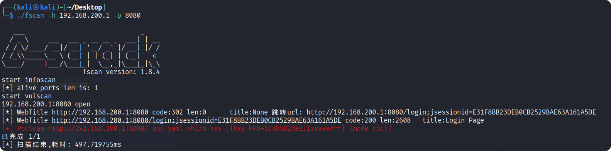

# Apache Shiro

Apache Shiro 是一个功能强大的 Java 安全框架，主要用于在 Java 应用中实现**身份认证（Authentication）、授权（Authorization）、加密（Cryptography）和会话管理（Session Management）**等安全相关功能。其目标是让安全变得简单易用，并能灵活集成到各种 Java 项目（Web、非 Web、微服务等）。

## CVE-2016-4437

ShiroAttack2 工具启动需要低版本 JDK

## 参考

<https://github.com/SummerSec/ShiroAttack2>
