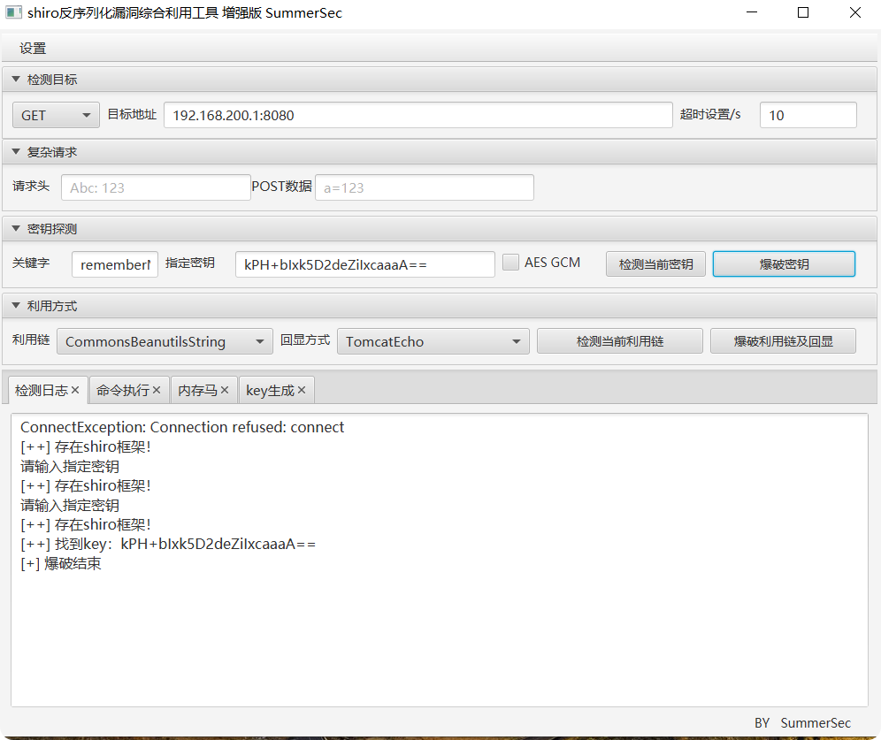

# Apache Shiro

Apache Shiro 是一个功能强大的 Java 安全框架，主要用于在 Java 应用中实现 **身份认证（Authentication）、授权（Authorization）、加密（Cryptography）和会话管理（Session Management）** 等安全相关功能。其目标是让安全变得简单易用，并能灵活集成到各种 Java 项目（Web、非 Web、微服务等）。

## CVE-2016-4437

Apache Shiro 1.2.4 及以前版本中，加密的用户信息序列化后存储在名为 remember-me 的 Cookie 中。攻击者可以使用 Shiro 的默认密钥伪造用户 Cookie，触发 Java 反序列化漏洞，进而在目标机器上执行任意命令。

ShiroAttack2 工具启动需要低版本 JDK，如 JDK8

## 参考

<https://github.com/SummerSec/ShiroAttack2>
<https://tttang.com/archive/1645/>
