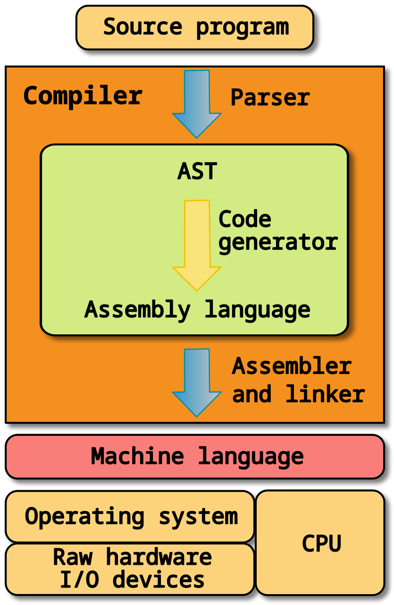

# 逆向工程

## 进制转换

## 字节序

字节序是指在计算机中存储多字节数据时，字节的顺序。主要有两种字节序：

- **大端字节序（Big-endian）**：高位字节存储在低地址，低位字节存储在高地址。
- **小端字节序（Little-endian）**：低位字节存储在低地址，高位字节存储在高地址。

例如，一个值为 `0x0A0B0C0D` 的整型数，采用小端序和大端序时在内存中的存储情况如下图所示。


x86 的 CPU 使用小端序。

<https://getiot.tech/computerbasics/endianness/>

<https://www.ruanyifeng.com/blog/2022/06/endianness-analysis.html>

```bash
```

<https://xiaolincoding.com/os/1_hardware/how_cpu_run.html>



## 反汇编

## 反编译

## 寄存器

寄存器（register）是CPU内部用于暂存指令、数据和地址的存储器。

常见的寄存器种类：

- 通用寄存器，用来存放需要进行运算的数据，比如需要进行加和运算的两个数据。
- 程序计数器，用来存储 CPU 要执行下一条指令「所在的内存地址」，注意不是存储了下一条要执行的指令，此时指令还在内存中，程序计数器只是存储了下一条指令「的地址」。
- 指令寄存器，用来存放当前正在执行的指令，也就是指令本身，指令被执行完成之前，指令都存储在这里。
段寄存器？

物理地址？逻辑地址？

现代（即386及以后）x86 处理器具有八个32位通用寄存器。32 位寄存器是以`E`开头，`E`代表扩展（extended）。


寄存器的名称承载着其历史和用途

- EAX，累加器（Accumulator），最初被设计为执行算术运算和数据操作的主要寄存器。
- EBX，基址寄存器（Base Register），指向数据段（DS段）中的数据。用于存储程序的基址。
- ECX, 计数器（Counter），最初用于循环和迭代操作，特别是在处理循环时，ECX被用来保持循环的计数器。
- EDX， 数据寄存器（Data Register），最初被设计来存储数据操作期间的附加数据，通常用于扩展特定运算（如乘法和除法）。
- ESI, 源索引寄存器（Source Index Register）
- EDI，目的索引寄存器（Destination Index Register）

但按照惯例，有两个寄存器保留为特殊用途，即栈指针（ESP）和基址指针（EBP）。

- ESP 栈指针（Stack Pointer）,始终指向当前栈顶的位置。在函数调用和返回、局部变量存储时，ESP 的值会发生变化。
- EBP 基址指针（Base Pointer）,通常用于指向当前函数的栈帧基址。它维护了一种稳定的方式来访问局部变量和函数参数。

请注意，上述每个寄存器都是32位或4字节长。EAX、EBX、ECX和EDX寄存器的低2字节可以通过AX进行引用，并可进一步细分为高字节（AH、BH、CH和DH）和低字节（AL、BL、CL和DL），每个字节长度为1字节。

此外，ESI、EDI、EBP和ESP也可以通过它们的16位等效寄存器SI、DI、BP和SP进行引用。

段寄存器

共有六个段寄存器，如下所示：

CS：代码段寄存器，用于存储代码段（.text段）的基址，供数据访问使用。

DS：数据段寄存器，存储变量的默认位置（.data段），供数据访问使用。

ES：额外段寄存器，在字符串操作过程中使用。

SS：堆栈段寄存器，存储堆栈段的基址，当隐式使用堆栈指针或显式使用基址指针时使用。

FS：额外段寄存器。

GS：额外段寄存器。

标志寄存器

IDA 界面 快捷键

IDA插件

GDB
调试

静态链接、动态链接

```c
#include <stdio.h>
int main()
{
   printf("Hello, World!");
   return 0;
}
```

magic

栈溢出

exeinfo

静态分析
动态分析

- ida，windows、linux
- pwndbg

迷宫问题

栈溢出

gdb => pwndbg

## 内存布局


- 每个进程在多任务操作系统中运行在独立的虚拟地址空间，32位系统的虚拟地址空间总是4GB。
- 程序的代码段（Text）包含可执行指令，通常是只读的，防止程序修改其指令。
- 数据段包含全局和静态变量，其内容可以在运行时改变，但可以分为只读和可写区域。
- BSS段存储所有未初始化的全局和静态变量，操作系统会在执行前将其初始化为0。
- 栈区用于存储函数调用的数据，以LIFO结构管理函数的局部变量和返回地址。
- 堆区用于动态内存分配，处理程序在运行时请求的内存，通常由malloc和free等函数管理。

[x64dbg](https://x64dbg.com/) 是一款免费且开源的调试器，支持32位和64位Windows应用程序的调试。

## IDA
